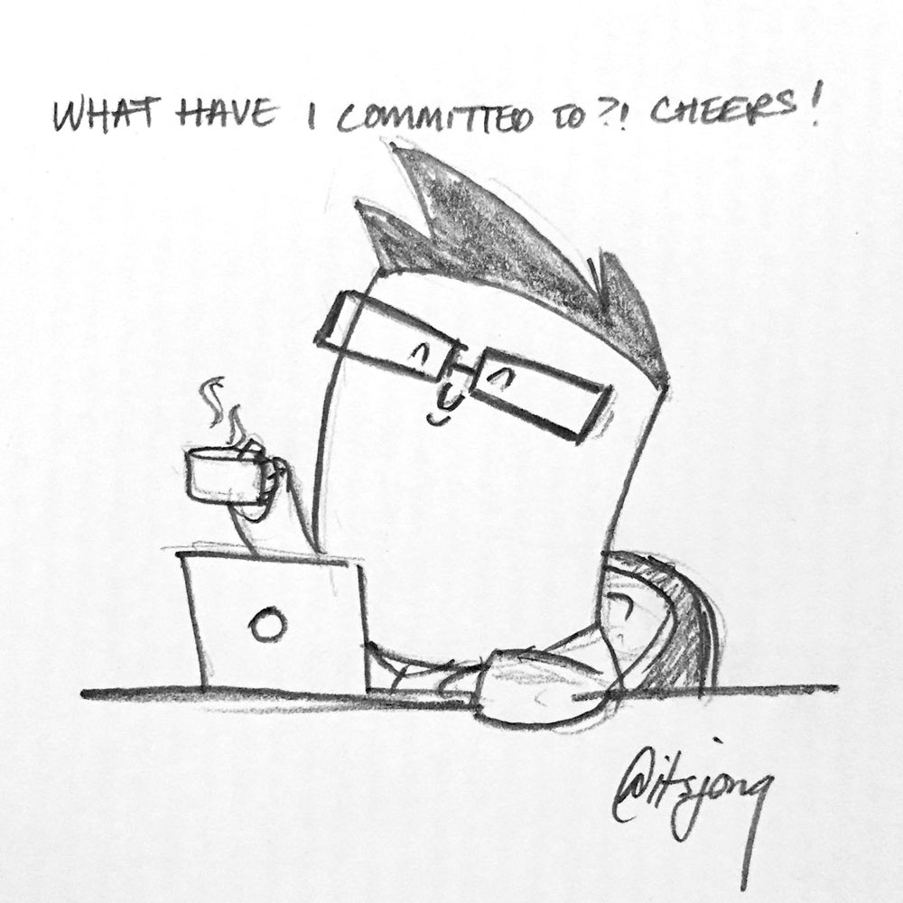

Goodness. Gracious. Why is writing so hard! Since re-launching my site, I've set a personal goal to write **at least** once a week. I gave myself a soft-pass this week, as I sorta missed my goal by a bit. But I was busy!

And **there we go with the excuses**. Lol. So, I decided to spend today (Sunday) trying to write something. Anything! And I still couldn't. I wrote about 5 half-posts today. All of them comprised mashed-together barely English sentences and bullet points.

> Writing is **hard**, guys.

But I knew this. I knew writing would be hard. I don't necessarily think it's a writer's block thing. It just isn't something that comes naturally to me - at all. But you know what does? Drawing. Or more specifically, doodling (especially on scrap paper).

On Friday, I was inspired to do a doodle of myself and share it on the [Twitters](https://twitter.com/itsJonQ).

<blockquote class="twitter-tweet" data-lang="en">
me_irl <a href="https://t.co/ROKPjT7PUj">pic.twitter.com/ROKPjT7PUj</a>
&mdash; Q ✨ (@itsJonQ) <a href="https://twitter.com/itsJonQ/status/936646149737295872?ref_src=twsrc%5Etfw">December 1, 2017</a></blockquote>

I've never drawn myself in that style before, but I really like it. So much in fact, that I've drawn and shared several more.

I'm sure it's a practice thing, which is what I'm going to try to do with writing. Heck, I forced myself to write… whatever post this is.

So here's to more posts, and definitely more doodles!

P.S. If you have any tips or feedback, please feel free to [send em](/contact) my way!
