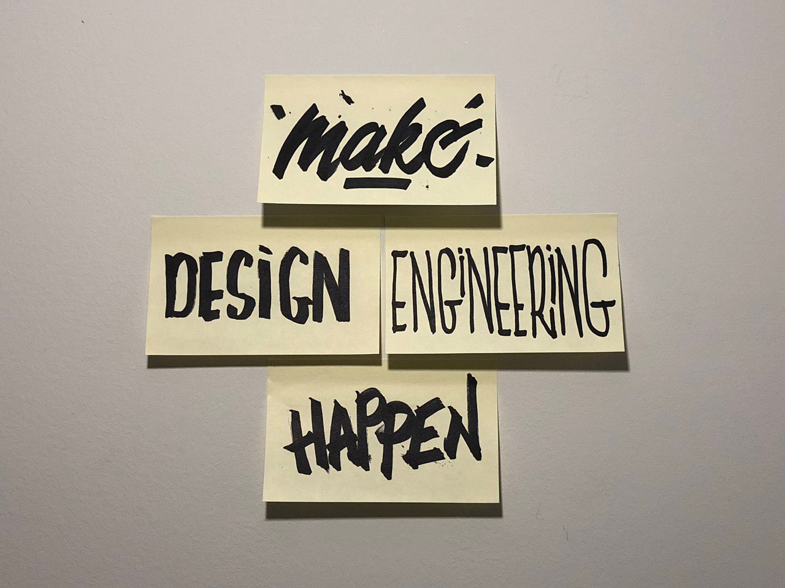

This year, I started mentoring at [Out of Office Hours](https://www.outofofficehours.com/). I've had multiple sessions, and one very interesting thing I've noticed is that every single person I've spoken to has said…

> "Wow! You're a Design Engineer! What does it mean to be a Design Engineer? I've never heard of it before!"

(Not in those exact words, but close enough!)

They seemed to not only be heavily intrigued by the concept of a "Design Engineer", but also passionately inspired by it. By connecting with these wonderfully lovely people, it helped me realize that I too was in their position not too long ago - except I didn't have a mentor, or speak to anyone in the industry, and I had to figure out everything on my own.

(I wrote about this experience in a previous post where I described what it [meant to be a Design Engineer](/posts/design-engineer-what-it-means/).)

In addition to mentoring, one goal I've had for a long time is to blog. For years I've tried this, and for years I've failed - miserably, but not completely. Upon reflection, I think it wasn't necessarily due to a lack of writing skills per se (that was my usual go-to excuse), but rather a lack of direction. I wanted to write… something… but never really knew what to write. I had fragments, many random fragments, but lacked the clarity to piece them together to make something substantial.

After these mentorship sessions, it dawned on it that there aren't a lot of resources that provide insight or guidance on how one can become a Design Engineer - at least, not very many that I've been able to find.

**And that's what it clicked**.

> O.M.G. I should try to make "Design Engineering" a thing! 😍

(At least, more of a thing compared to what it is now.)

That realization provided me with the clarity I had so desperately tried to find with my failed writing attempts. The stars aligned… (insert some other metaphor for stars aligning)… I had found my focus. At that moment, I had decided that I was gonna write about Design Engineering!

I was so inspired, that I wrote my "mission statement" on some Post-It notes and stuck it on my wall. I even took a photo of it and used it as my wallpaper for my devices.

In no way do I imagine becoming the "official" source/voice/figure for this role, although that would be pretty neat. My goal is to hopefully provide guidance, clarity, and insight for those who might want to go into this career, and to indirectly enhance my own abilities and understanding.

With these posts, I hope to make Design Engineering more of a thing. I hope to **make design engineering happen**!.

P.S. If you have any questions about Design Engineering or want to reach out for mentorship, please [contact me](/contact)!

P.P.S. I acknowledge that I'm not an English major and that I can barely write a single blog post without questioning everything and feeling like I've done a terrible job combining words together ✌️😅.
