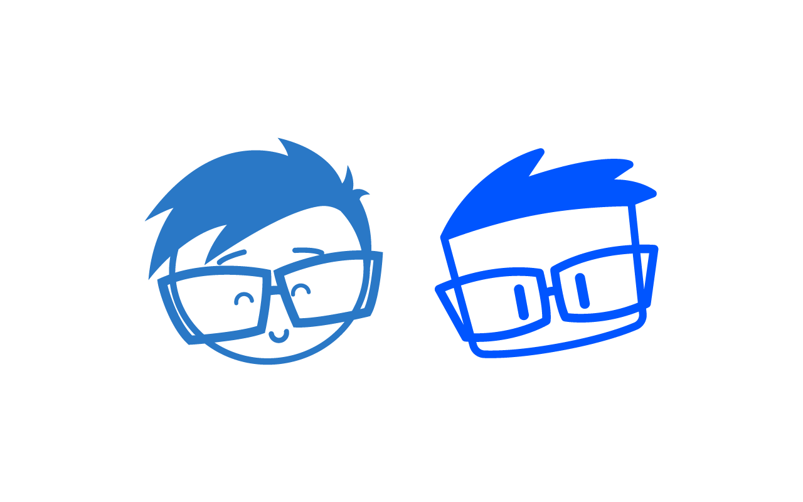
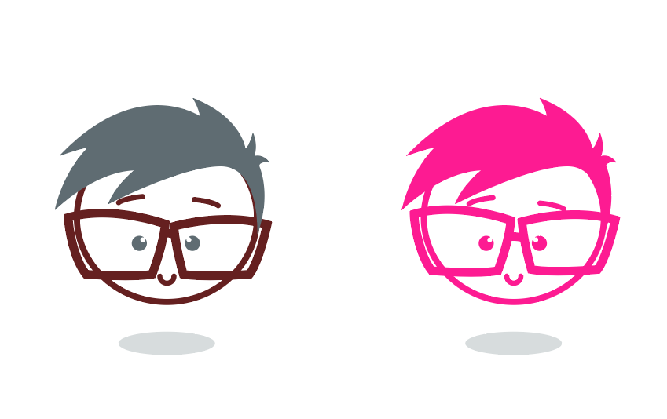
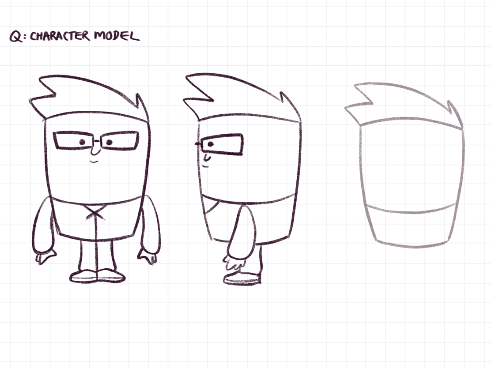
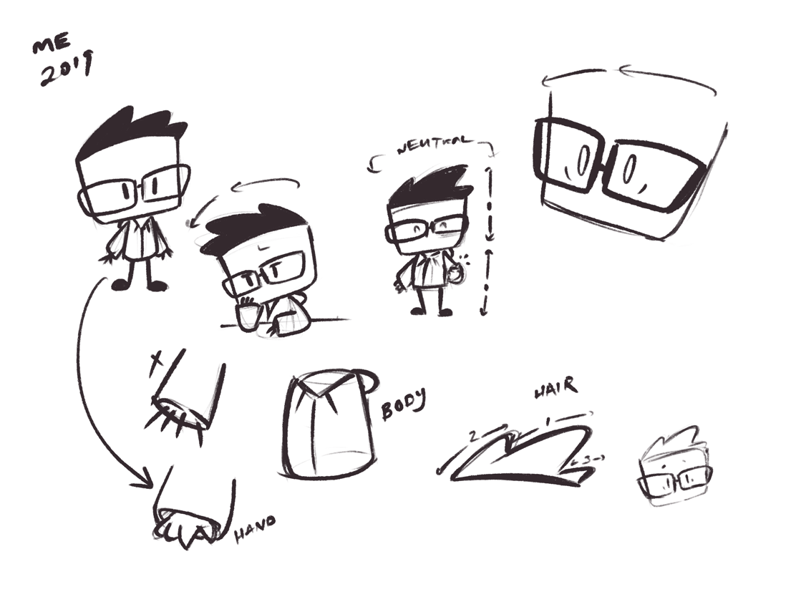

Happy New Year lovely Internet people! I hope all of you had a wonderful 2018, and have some fun-filled goals for 2019.

For me, among the usual _eat healthier_, _exercise more_, and _be more positive_ type of goals, one of my goals involved redesigning my "brand".

### Facelift

**Tada 🎉**! Check out my brand new selfie logo design (right).

#### The Old

I designed my original logo in early 2016.

One day, I randomly opened up Illustrator and quickly whipped up a little something. After 5 minutes of fiddling with circles and the pen tool work, I had my logo.

Every now and then, I would doodle little sketches or comics of my character.

> A good litmus test of a logo would be how quickly (and accurately) one could redraw it from memory.

For mine, I noticed that I would quite often miss the mark (how embarrassing). The hair would be off, or the glasses would look wonky. I would have to pull up my logo on my phone to reference while I sketched (if I wanted some more accurate, aka, true to "the brand"). The biggest issue was the overall complexity of it.

Firstly, **circles are a pain in the butt to draw**. Secondly, I would also usually forget how to "swoop" the hair.

#### The New

After feeling annoyed at circles, I started experimenting with rectangles and squares. This made sense, as I tend to have a square'ish face. Why didn't I make the orignal logo a square? I have no idea.

Between 2017 - 2018, I started doodling my characters with this rectangular Hanna-Barbera-esque design, inspired by the artwork from [The Ricky Gervais Show](https://en.wikipedia.org/wiki/The_Ricky_Gervais_Show).

Eventually, near the end of 2018, the design was simplified. I brought back the over-sized glasses from my original 2016 design, detached the head from the body, and shrunk the proportions of things.

Another notable change would be the shift from circular eyes to rectangular ones, inspired by the art from [Extra Creditz](https://www.youtube.com/user/ExtraCreditz). This doesn't seem like a big deal, but it was for me. I had never really drawn rectangular eyes for my doodles, so this seemingly tiny detail was an interesting and slightly uncomfortable shift!

Below is a video/gif of a quick sketch timelapse of my new selfie character. It was sketched on an iPad Pro (some model... not the newest one) with an Apple Pencil in [Procreate](https://procreate.art/).

<iframe src='https://gfycat.com/ifr/ExhaustedYawningGlobefish' frameborder='0' scrolling='no' width='100%' height='100%' style='position:absolute;top:0;left:0;' allowfullscreen></iframe>

 <a href="https://gfycat.com/ExhaustedYawningGlobefish">via Gfycat</a>

I wanted to update my personal site to go along with my updated logo. So...

### Re-Coded

I rebuilt and redesigned my website. The new site was rebuilt using [Gatsby](https://www.gatsbyjs.org/) - a fancy bit of JS technology for generating static sites.

Over the past couple of years, I've become heavily involved in React. A lot of this experience comes from working with [design systems](https://github.com/helpscout/hsds-react), [low-level utilities](https://github.com/helpscout/react-utils), and [data-management systems](https://github.com/helpscout/wedux) (just to name a few).

So far, my experience with Gatsby has been... meh (sorry Gatsby folks! I'm still rooting for you!). I absolutely love the React component-y side of things. Not so much the Gatsby side of things. I find it to be overly fiddly with it's setup and config - think Webpack config, but not nearly as bad (sorry Webpack folks! I still ❤️ you!). By comparison [Jekyll](https://jekyllrb.com/) is a **far** simpler system. I could go on. I probably will in another blog post.

Overall, I'm really happy with the new designs. The site is simpler, lighter, and it's Javascript based (hooray). And my updated selfie character is now way easier for me to draw. I still have other goals of course. Most of them carried over from last year including [making Design Engineering happen](/posts/make-design-engineering-happen/) and [writing more](/posts/lets-try-this-again/) (lol).

Thanks for checking out my post. I hope you lovely folks have a wonderful 2019!
