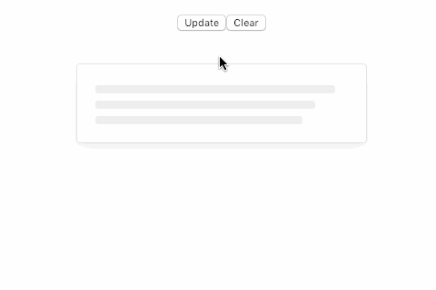
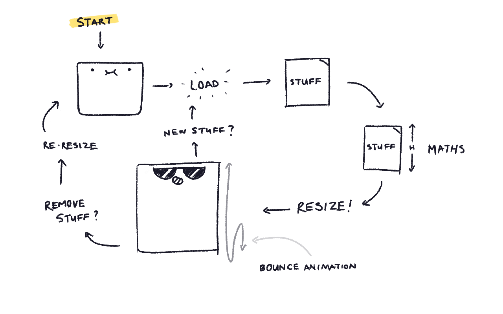

Every so often, I get randomly inspired to code something... experimental. Recently, I felt particularly ambitious, and thought it would be neat to create a self-resizing Card component with fancy animations.

In this post, I'm going to walk through the my thought process in creating this fancy component.

**Spoiler alert**... The result:



### The Objective

To create a Card component that...

- Automatically resizes itself based on it's content
- Resizes any time the content changes
- Renders a skeleton UI, when there's no content present
- Transition nicely between skeleton 👉 content
- Renders and animates at a stable 60fps
- And, oh yea!... Do all this ☝️ **automatically** without having to babysit the Card and manage state or whatever the heck (ugh)

### The Tools

For this experiment, I went with the following setup:

- [Codesandbox](https://codesandbox.io/dashboard), for development
- [React](https://reactjs.org/), for JavaScript component things
- [Fancy](https://github.com/helpscout/fancy), for styles
- [AnimeJS](https://animejs.com/), for animations

**Note**: The principles for building this component aren't specific to any of the libraries/frameworks specified above. You can achieve the same result with vanilla JavaScript and plain ol' CSS. I just happen to like these libraries 🤓.

### The Breakdown

Below is a sketch that details how the auto-resizing stuff is going to work:



The most important parts (or phases) are when...

- Content is added or removed, which triggers the **update** phase
- Recalcuating the desired height during the "**MATHS**" phase

### The Structure

This is essentially the bare bones HTML markup for our self-resizing Card:

```jsx
<div className="Card">
  <div className="CardContent">Content goes here...</div>
</div>
```

`div.Card` renders the fancy styles that make up the Card UI. In addition to fancy borders, padding, and shadows, the styles also need ensure that any **overflowing content** is **hidden**. This enables the resize effect to transition smoothly between varying content heights (e.g. Transitioning between a 1 sentence statement to a 10 sentence paragraph).

`div.CardContent` does not have any styles and contains either the content or the skeleton UI (if there is not content). It's responsible for **providing** the height, which is then applied to `div.Card`.

### The Update Phase

We need to recalculate and re-render our Card anything the contents have changed. With React, this can be made available via the [`componentDidUpdate`](https://reactjs.org/docs/react-component.html#componentdidupdate) lifecycle hook.

Once the update is triggered, we'll need to do some "**MATHS**"!

### The "MATHS" Phase

We'll need some JavaScript to calculate the desired height from `div.CardContent`. Once we have that, we'll make `div.Card` move using our animation strategy.

#### The Simple Version

The implementation should look something like this:

```js
updateHeight() {
  // 1. Calculations!
  const { clientHeight } = this.innerNode;
  const extraPadding = 20;
  const nextHeight = extraPadding + clientHeight;

  // 2. Run the animation
  anime({
    targets: this.node,
    height: nextHeight
  });
}
```

First, we need to calculate the height that we need to transition to. We can grab it from the `div.CardContent` element, and in our example, add some extra padding.

```js
const { clientHeight } = this.innerNode
const extraPadding = 20
const nextHeight = extraPadding + clientHeight
```

Next, we need to animate it! Since we're using [AnimeJS](https://animejs.com/), the library automatically transitions the specified property. In our case height, it's from the current value to the next value.

```js
anime({
  targets: this.node,
  height: nextHeight,
})
```

By the way, you can achieve the same effect using the CSS `transition` property. No fancy schmancy library required.

#### The Better (More Performant) Version

The Simple Version ☝️ works... with some caveats.

- Any update/re-render will trigger the animation calculations, even if the height does not change.
- Resizing during mid-resize causes a janky transition. This occurs when an update happens too quickly.

To resolve these issues, we'll need to do the following:

```js
updateHeight() {
  // 1. Calculations!
  const { clientHeight } = this.innerNode;
  const extraPadding = 20;
  const nextHeight =  extraPadding + clientHeight;

  // 2. Minor performance handling
  if (this.height === nextHeight) return;
  this.height = nextHeight;

  // 3. Pause the (possibly running) animation
  if (this.animation) {
    this.animation.pause();
  }

  // 4. Cache the running animation instance
  this.animation = anime({
    targets: this.node,
    height: nextHeight
  });
}
```

To ensure that we don't unnecessarily run the animation, we can cache the calculated height during the initial occurance. Any subsequent calculations can check against the cached value.

If it's the same, then don't do anything! Otherwise, proceed with the animation, and update the cached value. Rinse and repeat!

```js
if (this.height === nextHeight) return
this.height = nextHeight
```

We can use the same caching trick with the AnimeJS animation instance. We'll cache the instance during the initial run. Any subsequent runs will pause the previous animation (if applicable), and update the cached value when we create the new animation.

```js
// 3. Pause the (possibly running) animation
if (this.animation) {
  this.animation.pause()
}

// 4. Cache the running animation instance
this.animation = anime({
  targets: this.node,
  height: nextHeight,
})
```

And with that, we have an performant self resizing animating UI.

### The Skeletons

Now that the hard part is over (phew), we need to take care of the skeleton UI (aka. blank/empty state). The logic for this is pretty simple! If the Card component has content, then render the content! Otherwise, render our skeleton UI.

An example of this logic may look something like this:

```jsx
render() {
  const content = children || <SkeletonUI />

  return (
    <div className="Card">
      <div className="CardContent">{content}</div>
    </div>
  )
}
```

### The Result


Pretty spiffy, if I do say so myself!

Thankfully, this was a success little experiment. Sometimes I'm not so lucky! However, I always enjoy the process, and most importantly, I always **learn something**.

Hopefully you found this post enjoyful or helpful in some way! Either way, thanks for checking it out 😊.

Here's a linky to the **[source code](https://codesandbox.io/s/4xrjz4yoz0)** (for you curious ones out there).

**Bonus!** Here's [another version](https://codesandbox.io/s/v615jrl065) with images!
